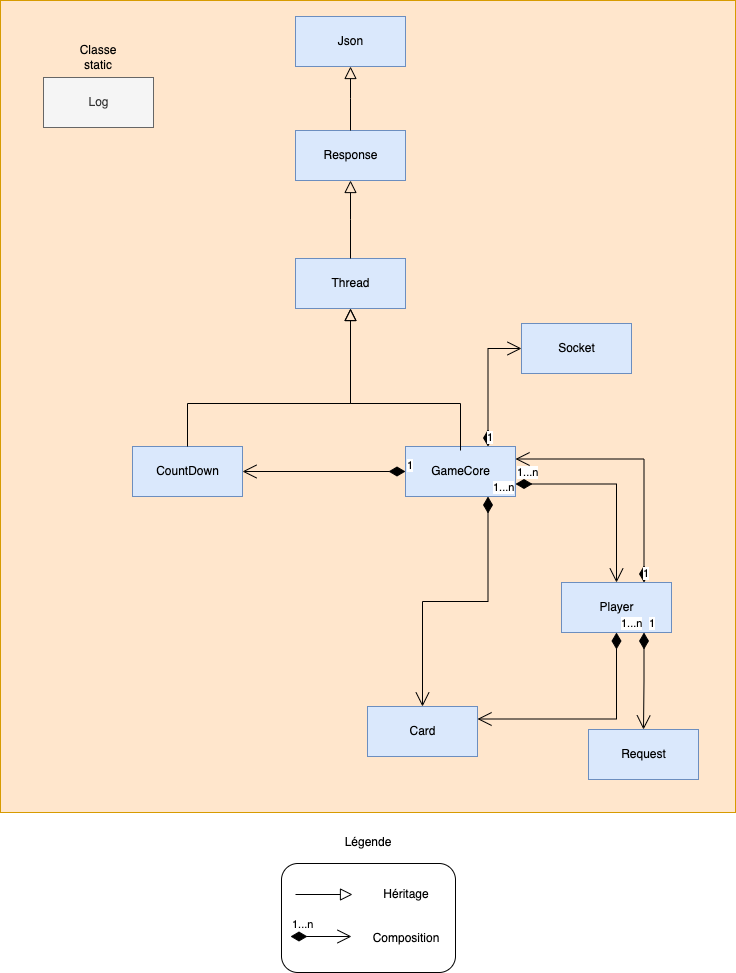

<p align="center">
  <a href="https://example.com/">
    
  </a>

  <h3 align="center">Ynov - M2 Dev Logiciel, Mobile & IoT</h3>
</p>

## Dev logiciel avancé

- [About us](#about-us)
- [About this project](#about-this-project)
- [Prerequisites](#prerequisites)
- [What's included](#whats-included)
- [How its work](#how-its-work)
- [How to install](#how-to-install)
- [Why we choose electronjs](#why-we-choose-electronjs)
- [Docs](#docs)

## About us

### Tripot Melanie

- melanie.tripot@ynov.com

### Lemoine Kaunogan

- kaunogan.lemoine@ynov.com

### Gumbau Elric

- elric.gumbau@ynov.com

## About this project

This project takes up the idea of [6 qui prend !](https://www.gigamic.com/jeu/6-qui-prend) board game.

### Back

- Implements all the rules of the game.
- Wait, receives and processes player actions.
- Communicate with socket.
- Manage 1 game of 2 to 10 players.
- Use mutli-threading.
- Is written in C++.

### Front

- Allows the player to take actions when they need to play, manages the display of the state of the game.
- Sends player actions to the server.
- Receive the state of the game via sockets.
- Is written in Vue.js and uses electronjs.

## Prerequisites

    Back is written for linux operating system. You must compile the source files with this OS !

Here are the prerequisites necessary for this project

<div align="center">

| Prerequisites |
| ------------- |
| GNU Compiler  |
| Make          |
| Node.js (v16) |

</div>

    Ask google how to install these tools if you don't have them 😉

## What's included

You will find below the main folders and files to use for this project

```text
back/
└── src/
    ├── class/
    │   ├── Game/*
    │   ├── Log/*
    │   └── utils/*
    └── main.cpp
└── Makefile
```

## How its work

Diagram representing the interaction between C++ classes

<p align="center">
    
</p>

Below you will find the keyword used for the communication protocol

<div align="center">

| Type   | Command          | Description                                               |
| ------ | ---------------- | --------------------------------------------------------- |
| client | setName          | send client name                                          |
| client | setReady         | send if client are ready or not                           |
| client | playCard         | send the played card                                      |
| client | chooseRow        | choose row to flush                                       |
| client | EXIT             | exit the game                                             |
| server | nameSet          | send the name setted                                      |
| server | newPlayer        | send to opponents players the new connected client        |
| server | playersConnected | get players already connected                             |
| server | alreadyPlayed    | client already played card                                |
| server | isReady          | send to client if it is well connected                    |
| server | playerReady      | send to opponents players that the player is ready        |
| server | playerNotReady   | send to opponents players that the player is not ready    |
| server | playerPlayed     | send to opponents players that the player played his card |
| server | cardRemoved      | indicates to the player that his card has been deleted    |
| server | countDow         | countDown is started or not                               |
| server | showCards        | show the players cards                                    |
| server | showDeckRound    | show all cards played                                     |
| server | clearDeckRound   | clear all cards played                                    |
| server | showRows         | show the rows                                             |
| server | chooseRow        | asks the player to choose a row                           |
| server | playerChooseRow  | send to opponents players that the player choose a row    |
| server | newRound         | new round is started                                      |
| server | endGame          | finish the game                                           |
| server | playerExit       | send to opponents players that the player exited the game |

</div>

## How to install

- Clone this git repo and place it anywhere on your pc

### Back

- Open a terminal, go to the folder 'back' and type

```bash
  make
  build/server 127.0.0.1 YOUR_PORT
```

> 'make' use the g++ compiler to compile all the files. The compiled file is in build folder.

> 'build/server' start the socket server with the ip and port you specified

If you see the following line on the terminal

```text
  [SOCKET] === SERVER STARTED ===
```

that mean that all the is ok !

Well done !

### Front

- Open a terminal, go to the folder 'front' and type

```bash
  npm i --legacy-peer-deps
  npm run electron:serve
```

> 'npm i' install node modules.

> 'npm run electron:serve' start a electron app.

Follow the instructions.

Enjoy ! 😉

## Why we choose electronjs

We chose electronjs because we have more ease with the javascript language compared to C# and WPF does not exist on a linux OS.
We could not set up a docker image because there is a lot of incompatibility with electronjs.

## Docs

C++ : https://docs.microsoft.com/fr-fr/cpp/cpp/?view=msvc-170

GNU : https://fr.wikipedia.org/wiki/GNU

C++ socket : https://c.developpez.com/cours/sockets-c-cpp-demystifies/

Makefile : https://blog.octo.com/comment-le-makefile-maide-a-faire-de-lops-en-tant-que-dev/

Vue.js : https://vuejs.org/

Electron : https://www.electronjs.org/
